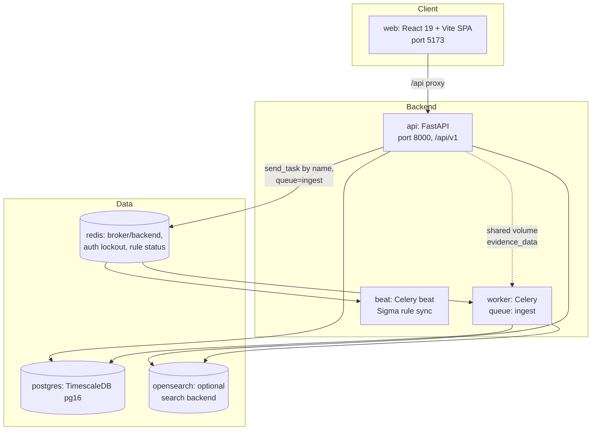
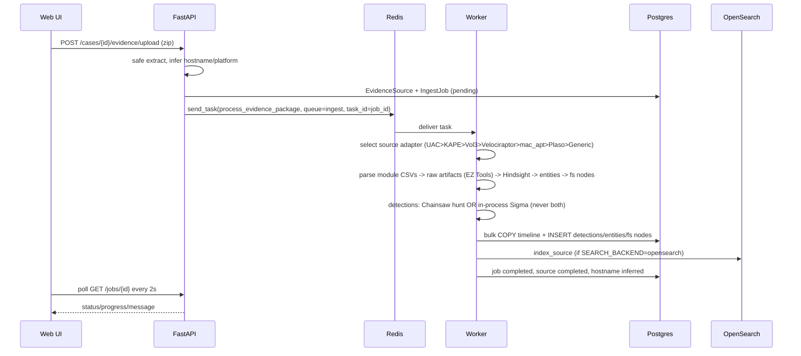

# Codebase Map

> Auto-generated by Cartographer. Last mapped: 2026-07-18

Corvus is an offline forensic triage review platform: it ingests endpoint evidence packages (KAPE, UAC, Velociraptor, generic directories, memory images), parses artifacts, runs detections (Sigma / Chainsaw / YARA), and presents linked investigation views.

## System Overview



Cross-service contract: `packages/corvus_core` (Pydantic schemas + constants) is `pip install`ed into both `api` and `worker` images. The API never imports worker code — all task dispatch is by string task name via `celery_app.send_task(..., queue="ingest")`.

## Directory Structure

```
apps/
  api/                  FastAPI REST API
    app/
      main.py           App assembly, router mounting, lifespan (migrations + admin bootstrap)
      config.py         pydantic-settings; env toggles, feature flags
      database.py       Engine/session, init_db() -> alembic upgrade head
      models.py         SQLAlchemy ORM models (UUID PKs, 2.0 Mapped style)
      schema_migrations.py  Idempotent DDL helpers called ONLY from Alembic revisions
      celery_client.py  Celery producer (send_task only)
      package_extract.py  Safe ZIP/TAR extraction (traversal/symlink/limits)
      auth/             JWT auth, providers, bootstrap admin
      routers/          21 routers under /api/v1
      services/         admin_ops, case_purge, docker_ops, ingest_outcome, opensearch_service, readiness
      util/             evidence_storage
    alembic/            6-revision linear migration chain
    tests/              Unit tests w/ hand-rolled fake DB sessions (no conftest)
  worker/               Celery ingest/parsing/detection worker
    worker/
      celery_app.py     App + beat schedule + orphan-job reconcile on boot
      config.py         WorkerSettings (env)
      db.py             Engine/session
      search_index.py   OpenSearch bulk indexing (no-op unless SEARCH_BACKEND=opensearch)
      tasks/            ingest (main pipeline), hash_evidence, yara_scan, sigma/chainsaw/yara rule refresh, recovery
      sources/          Source adapter registry (disk_image, UAC, KAPE, Volatility3, Velociraptor, mac_apt, Plaso, Generic)
      kape/             detector.py + ingest.py — the SHARED generic parser stack (not KAPE-only)
      parsers/          csv_events, external_events, entities, filesystem builders
      sigma/            In-process Sigma engine (loader, matcher, dfir_filter, evaluate, sync)
      chainsaw/         Chainsaw hunt orchestration (evtx_select, hunt, evaluate, sigma_rules)
      hindsight/        Chromium browser forensics (profiles, runner, parser)
      eztools/          EZ Tools subprocess wrappers (EvtxECmd, MFTECmd, RECmd, PECmd, AmcacheParser)
      util/             pg_sanitize (NUL-byte stripping)
    tests/              20 pure-function unit test files
    yara/               Bundled smoke-test YARA rule
  web/                  React 19 + Vite SPA
    src/
      App.tsx           Auth-gated routes
      api/client.ts     Single fetch wrapper — ALL backend calls go through here
      pages/            LoginPage, CasesPage, CaseDetailPage (workspace), AdminUsersPage, ControlPanelPage
      components/       TimelineView, ObjectView, DiskView, MftView, BrowserView, GlobalSearch, etc.
      utils/            eventCodes.ts + generated/ (vendored event-ID description maps)
    e2e/                Playwright tests (mocked backend + optional real-backend flow)
packages/
  corvus_core/          Shared Pydantic schemas + constants (JobStatus, EvidencePlatform, KapeCategory)
scripts/                Install/fetch/validate/smoke-test shell scripts
docs/                   DEPLOYMENT, EVIDENCE-PACKAGE, OPEN-SOURCE-PARSERS, PARSER-COMPAT, ALEMBIC_WORKFLOW, PROJECT
third_party/licenses/   Vendored license texts
```

## Module Guide

### API (`apps/api`)

**Purpose**: REST API for cases, evidence upload, investigation views, detections, admin.
**Entry point**: `apps/api/app/main.py`

**Startup flow**: lifespan hook runs `validate_security_settings()` → `init_db()` (programmatic `alembic upgrade head` + `ensure_bootstrap_admin`). No runtime DDL outside Alembic; `schema_migrations.py` helpers are migration-only.

**Models** (`apps/api/app/models.py`):

| Model | Table | Notes |
|---|---|---|
| `Case` | `cases` | 1→N EvidenceSource, cascade delete |
| `EvidenceSource` | `evidence_sources` | Platform/collector/hash/yara metadata, `manifest` JSONB |
| `IngestJob` | `ingest_jobs` | Structured error taxonomy: `error_code`/`error_stage` |
| `TimelineEvent` | `timeline_events` | **Composite PK `(timestamp_utc, id)`** for TimescaleDB hypertable; JSONB `data`, `entity_refs`, `sigma_hits` |
| `SigmaDetection` | `sigma_detections` | Unique `(evidence_source_id, engine, rule_id)`; engine = sigma / chainsaw / yara |
| `FilesystemNode` | `filesystem_nodes` | `full_path`/`parent_path` tree browsing |
| `Entity` / `Relation` | `entities` / `relations` | Typed entities + attributes JSONB |
| `EvidenceFileHash` | `evidence_file_hashes` | Per-file sha256/sha1/md5 |
| `User` | `users` | Roles: `administrator` \| `analyst` |

Timeline/filesystem/entity rows carry raw `evidence_source_id` FK columns without ORM `relationship()` navigation (hypertable design).

**Router inventory** (prefix `/api/v1` unless noted):

| Router | Prefix | Auth | Purpose |
|---|---|---|---|
| `root` | `/api/v1` | none | API discovery |
| `health` | `/health` | none | Liveness + `/health/ready` dependency checks |
| `auth` | `/auth` | self-guarded | login/logout/me + admin user management |
| `admin` | `/admin` | admin + `ENABLE_ADMIN_API` | overview, jobs, purge, reindex, wipe |
| `containers` | `/admin/containers` | admin | Docker Compose control panel (needs docker.sock) |
| `cases` | `/cases` | user | CRUD + rename |
| `evidence` | `/cases/{id}/evidence` | user | upload, reingest, jobs, hash/yara compute + export |
| `jobs` | `/jobs` | user | get, cancel |
| `ingest_outcome` | `/jobs/{id}/outcome` | user | CI-facing structured checks |
| `validation` | `/validation` | admin + `ENABLE_VALIDATION_API` | sample/upload ingest for testing |
| `timeline` | `/cases/{c}/sources/{s}/timeline` | user | filtered list (limit≤10000), count, CSV export, single event |
| `filesystem` | `.../filesystem` | user | tree, search, hex preview, download, hashes |
| `entities` | `.../entities` | user | list, per-entity timeline |
| `search` | `.../search` | user | OpenSearch or Postgres ILIKE fallback |
| `stats` | `.../stats` | user | counts + histogram |
| `sigma` | `.../sigma` | user | per-source detections |
| `sigma_rules` / `chainsaw_rules` / `yara_rules` | `/{engine}/rules` | user | status + refresh (queues worker task) |
| `detection_rules` | `/detection-rules` | user | combined status |
| `system_status` | `/system/status` | user | CPU/mem/disk/job counts |

**Auth** (`apps/api/app/auth/`): local bcrypt provider (constant-time even on missing user), HS256 JWT (480 min, `jti`), Redis-backed revocation denylist (**fails open** unless `AUTH_REVOCATION_FAIL_CLOSED=true`), Redis login lockout (5 attempts / 5 min → 10 min lockout), `OidcAuthProvider` placeholder. No per-case ACL — single-tenant analyst model.

**CSV exports** (`timeline/export`, `evidence/{id}/hashes/export`): both stream canonical comma rows through `app/util/csv_export.py`, which prefixes values that a spreadsheet would parse as a formula (leading `=`, `+`, `-`, `@`, their full-width forms, or a whitespace control) with `'`. It also prefixes formula-like starts after semicolon, tab, or line boundaries so alternate-delimiter parsing does not expose an active derived data cell; alternate parsing is not expected to preserve comma columns. Plain numbers are exempt only as whole original values. Escaping applies at the CSV boundary only — stored rows, JSON responses, and worker COPY serialization keep the original bytes. Disable with `CSV_EXPORT_FORMULA_ESCAPE=false`.

**Timeline export truncation** (`timeline/export`): the export is capped at `TIMELINE_EXPORT_MAX_ROWS` (default `50000`) rows of the filter's timestamp-ascending order, so a capped export keeps the *oldest* matches. The cap is reported additively in `X-Corvus-Export-Truncated`, `-Row-Limit`, `-Row-Count`, and `-Total-Matches` response headers (exposed via CORS) rather than in the CSV body, which stays byte-identical to an untruncated export of the same rows. `timeline/count` returns `export_row_limit` alongside `count` so `TimelineView` can warn through the shared `ConfirmDialog` before starting a truncated download.

**Services**: `opensearch_service.py` (dual-path search; returns `None` on failure to trigger Postgres fallback), `case_purge.py` (DB cascade + disk + OpenSearch cleanup incl. orphan dirs), `ingest_outcome.py` (pure check-list builder), `readiness.py`, `admin_ops.py`, `docker_ops.py`.

**Alembic** (`apps/api/alembic/`): linear 6-revision chain, single head enforced by `tests/test_migration_integrity.py`. Timescale conversion (rev 0004) only fires when `timeline_events` is empty and extension present. CI guard: schema-file changes without a new revision fail (`scripts/require_migration_for_schema_changes.sh`, `.github/workflows/api-migrations.yml`).

### Worker (`apps/worker`)

**Purpose**: Async ingest, parsing, detection, hashing, YARA scan.
**Entry point**: `apps/worker/worker/celery_app.py`; main task `worker.tasks.ingest.process_evidence_package(job_id, source_id)`.

**Source adapters** (`worker/sources/registry.py`) — first match wins:

1. `UacImportAdapter` — UAC markers (nested up to depth 4); forces platform to linux
2. `DiskImageAdapter` — E01/RAW images parsed in place by Plaso (no mounting); merges `GenericDirectoryAdapter` results for loose files
3. `KapeCompatAdapter` — `collector=="kape"` or KAPE layout detected
4. `Volatility3Adapter` — memory images (`.raw .mem .vmem ...`); Windows-only via banners pre-check, max 2 images
5. `VelociraptorImportAdapter` — collector or heuristic
6. `MacAptAdapter` — `platform=="macos"`; runs mac_apt or imports output, falls back to Plaso
7. `PlasoAdapter` — `collector=="plaso"` + binaries present; parallel per-OS parser families
8. `GenericDirectoryAdapter` — always matches directories

**Key insight**: `worker/kape/ingest.py::ingest_package()` is the shared collector-neutral parser stack — both `KapeCompatAdapter` and `GenericDirectoryAdapter` call it; external-tool adapters merge Generic results in as supplement.

**Detection engines**:
- **Sigma in-process** (`worker/sigma/`): compiled rule cache invalidated by mtime signature; `dfir` profile filters to IR-actionable rule paths; unsupported Sigma features (`|count`, `|near`, `timeframe`, `keywords:`, `cidr`) never match. Used only when Chainsaw Sigma integration is off.
- **Chainsaw** (`worker/chainsaw/`): priority-ranked EVTX selection (Security/Sysmon/PowerShell... up to `CHAINSAW_EVTX_MAX=64`), batched parallel hunts, hits correlated back to timeline events by `(EventID, RecordID, Computer)`. `dfir` Sigma profile builds a hardlinked filtered rules cache. Mutually exclusive with in-process Sigma via `CHAINSAW_ENABLED && CHAINSAW_INCLUDE_SIGMA`.
- **YARA** (`worker/tasks/yara_scan.py`): compiles all rules with dynamic `externals` retry, stores findings as `sigma_detections` rows with `engine='yara'` — `sample_event_ids` there are **file paths**, not event IDs.

**Bulk write** (`worker/tasks/ingest.py`): timeline via Postgres `COPY` (10k batches) with parameterized-INSERT fallback; `SET LOCAL synchronous_commit TO OFF`; cancellation honored by polling job row between stages (no Celery revoke); on any failure, `_clear_source_data()` deletes partially committed rows + OpenSearch docs.

**Other tasks**: `hash_evidence_files` (thread-pooled sha256/sha1/md5), `refresh_{sigma,chainsaw,yara}_rules` (shell to fetch scripts, status JSON to Redis keys `corvus:{engine}:rules:status`), `recovery.reconcile_orphaned_ingest_jobs` (on `worker_ready`, after a bounded grace window in a daemon thread: probes Celery `active`/`reserved`/`scheduled` for ingest task ids — job id == dispatched task id. The probe is presence-only evidence: a non-answering worker is absent from the reply, so an unclaimed job is *not* proof of an orphan. Default `WORKER_RECONCILE_UNCLAIMED_ACTION=skip` logs unclaimed jobs and leaves them `running`; `fail` marks them `error_code='interrupted'` / `error_stage='worker_restart'` and can fail a live ingest on a silent worker).

**EZ Tools** (`worker/eztools/runner.py`): `dotnet <Tool>.dll` wrappers, 1hr timeout each, failures return `None` (non-fatal).

**Hindsight** (`worker/hindsight/`): Chromium profile discovery (handles `Network/Cookies` nesting), sha1-suffixed output names, JSONL mapped to `browser.*` event types.

### Web (`apps/web`)

**Purpose**: Analyst SPA. React 19 + react-router 7 + `@tanstack/react-virtual`. No state library — local state + prop drilling; no CSS framework — hand-written `App.css` (2740 lines).
**Entry point**: `src/main.tsx` → `src/App.tsx`.

**Routes**: `/login`, `/` (CasesPage), `/cases/:caseId` (CaseDetailPage — the workspace), `/admin/users`, `/admin/control-panel`.

**API client** (`src/api/client.ts`): single `request<T>` wrapper — all backend calls must go through it (repo convention). Token in `localStorage` key `ff_auth_token`; `ApiAuthError` on 401; `VITE_API_URL` discarded for localhost (relies on Vite proxy `/api` → `http://api:8000`).

**Workspace hierarchy**:

```
CaseDetailPage  (owns cross-view pivot state: focusTimeline / focusPath / focusEntity)
├── sidebar: upload zone, source list, hash/YARA actions, findings stat-cards
├── IngestStatusPanel (during ingest)
├── SigmaFindingsPanel + GlobalSearch
└── tabs: TimelineView | ObjectView | DiskView | MftView* | BrowserView*
    (* shown only when stats.mft_count / browser_count > 0)
```

**TimelineView**: virtualized, sparse page cache (`PAGE_SIZE=10000`), scrollbar-thumb bottom-jump special case, sqrt-scaled SVG histogram (`TimelineChart`). **MftView**: separate table, server pages of 500, client-side sort/search within loaded page only, timestomping flag when `$STANDARD_INFO < $FILE_NAME`. **DiskView**: tree browse + hex preview (512-byte windows). **BrowserView**: category tabs, load-more paging (200).

**Polling intervals**: ingest/hash/yara jobs 2s; system status + admin overview 15s; GlobalSearch debounce 300ms; `/` keyboard shortcut focuses search.

**E2E** (`apps/web/e2e/`): `helpers.ts` mocks the whole API surface; `analyst-flows.spec.ts` includes 25k-row paging test; `backend-analyst-flow.spec.ts` runs against live backend only with `PLAYWRIGHT_BACKEND_E2E=1`; `screenshots.spec.ts` regenerates README images.

### Shared core (`packages/corvus_core`)

`constants.py` (`JobStatus`, `EvidencePlatform`, `KapeCategory`, KAPE CSV hints) + `schemas.py` (all API DTOs). Changing a schema affects both api and worker — update both. Routers import from `corvus_core.schemas` directly, not the package root.

## Data Flow — Evidence Ingest



Ingest priority tiers (docs/EVIDENCE-PACKAGE.md, confirmed in code): (1) pre-generated parser CSV/JSON, (2) raw artifacts when not pre-parsed (dedup via `_preparsed_categories()`, which suppresses only categories whose module CSV yielded at least one event), (3) filesystem nodes from collected paths / event path fields.

## Conventions

- **Schema changes**: Alembic only. New revision required by CI when `models.py`/`schema_migrations.py`/`database.py` change.
- **Task dispatch**: always `send_task` by string name with explicit `queue="ingest"` — worker consumes only that queue; default `celery` queue is unconsumed.
- **Web API calls**: only through `src/api/client.ts`.
- **Pagination**: `limit`/`offset` query params with per-endpoint caps; timeline ordered by `(timestamp_utc, id)` for stable paging.
- **Feature-flagged routers** raise 404 (not 403) when disabled — hides route existence.
- **Sanitization**: all worker DB writes pass through `pg_sanitize` (NUL bytes break psycopg jsonb).
- **Tests**: API tests use hand-rolled fake DB sessions + dependency overrides (no real Postgres); worker tests are pure-function unit tests; ingest DB-writing covered by `scripts/validate-ingest.sh` / e2e instead.

## Gotchas

- **Search silently no-ops** unless `SEARCH_BACKEND=opensearch` — default is `postgres` (ILIKE fallback with trigram indexes); worker indexing becomes a no-op.
- **Detection exclusivity**: `CHAINSAW_INCLUDE_SIGMA=true` disables in-process Sigma entirely; only one engine path runs per ingest.
- **Timescale hypertable** conversion only happens if `timeline_events` is empty at migration time — existing deployments silently stay plain Postgres.
- **Token revocation fails open** on Redis errors unless `AUTH_REVOCATION_FAIL_CLOSED=true`; dev mode allows the default insecure `AUTH_SECRET_KEY` (only prod/staging validate).
- **Cancellation** is DB-flag polling (`status='failed' AND message LIKE 'cancelled%'`), not Celery revoke.
- **Partial-write cleanup**: bulk inserts commit per batch; any pipeline failure triggers manual `_clear_source_data()` across four tables + OpenSearch.
- **`VALIDATION_MODE_FAST`** (`manifest.ff_validation_mode=="fast"`) skips Sigma/Chainsaw/OpenSearch — used by validation harness.
- **Module-CSV dedup is substring-based** (`evtxecmd` etc. in filename) **and event-gated** — a coincidentally named CSV suppresses raw parsing of that category only if it contributed at least one timeline event. A header-only or timestamp-less match suppresses nothing and adds an ingest note; with several matching CSVs, one populated CSV keeps the category suppressed.
- **YARA detections** reuse `sigma_detections`; `sample_event_ids` hold file paths for `engine='yara'`.
- **`DELETE_EVIDENCE_AFTER_INGEST=true`** irreversibly rmtree's the package after success.
- **CSV exports may differ from JSON serialization** by CSV field quoting and one leading `'` on formula-like cells; compare against the JSON endpoints when byte-exact evidence values are needed.
- **Worker boot reconcile**: the Celery `active`/`reserved`/`scheduled` inspect probe is presence-only, so an unclaimed job is not proof of an orphan. Default `WORKER_RECONCILE_UNCLAIMED_ACTION=skip` logs unclaimed jobs and leaves them `running`; opt-in `fail` marks them `error_code='interrupted'` but can falsely fail a live ingest whose worker did not answer the probe.
- **web dead code**: `SigmaRulesSync.tsx` is unused (superseded by ControlPanelPage rules ops). `TimelineView` duplicates `ResizableSplit` logic inline.
- **`utils/generated/` files** claim "re-generate from source" but no generator script exists in-repo — effectively vendored static data.
- **MftView search** only searches the currently loaded 500-row server page.
- **`yara_rules.py`** hardcodes `/usr/local/bin/fetch-yara-rules.sh` (sigma/chainsaw resolve paths dynamically).
- **Plaso timeout is per family invocation** (1800s each) when parallel families enabled.
- **Velociraptor is import-only** (AGPL-3.0 — never bundled); Plaso/mac_apt/Volatility3 are opt-in image build args (`INSTALL_OPEN_FORENSICS`, `INSTALL_VOLATILITY3`, default false).

## Navigation Guide

**Add a new API endpoint**: router in `apps/api/app/routers/`, mount in `apps/api/app/main.py` with auth dependency, DTO in `packages/corvus_core/corvus_core/schemas.py`, wrapper in `apps/web/src/api/client.ts`, test in `apps/api/tests/`.

**Add a schema/DB change**: `apps/api/app/models.py` + new Alembic revision under `apps/api/alembic/versions/` (CI enforces), update `tests/test_migration_integrity.py` revision list.

**Add a new source adapter**: implement `SourceAdapter` protocol in `apps/worker/worker/sources/`, register in `registry.py` `_ADAPTERS` (order matters — first match wins), add selection test in `apps/worker/tests/test_source_adapters.py`, document in `docs/OPEN-SOURCE-PARSERS.md`.

**Add a new artifact parser**: `apps/worker/worker/parsers/` (or eztools wrapper), wire into `worker/kape/ingest.py::ingest_package()`, update `_MODULE_CSV_CATEGORY` / `detect_kape_layout()` if it has a pre-parsed CSV form.

**Add a new investigation view/tab**: component in `apps/web/src/components/`, wire tab + pivot state in `apps/web/src/pages/CaseDetailPage.tsx`, endpoints via `client.ts`.

**Modify auth**: `apps/api/app/auth/{providers,service,bootstrap}.py`, router `auth.py`, tests `test_auth.py`.

**Modify detections**: Sigma → `apps/worker/worker/sigma/`; Chainsaw → `apps/worker/worker/chainsaw/`; YARA → `apps/worker/worker/tasks/yara_scan.py`; engine gating in `worker/tasks/ingest.py`.

**Debug a failed ingest**: `GET /api/v1/jobs/{id}` + `/jobs/{id}/outcome`; error taxonomy in `worker/tasks/ingest.py::classify_ingest_failure`; worker logs; `scripts/validate-ingest.sh`.
